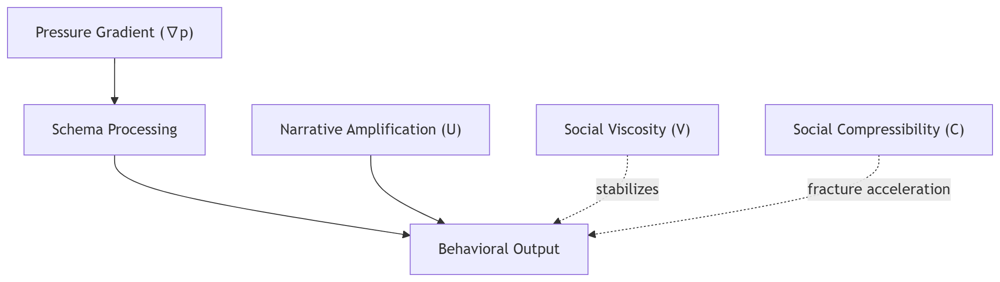
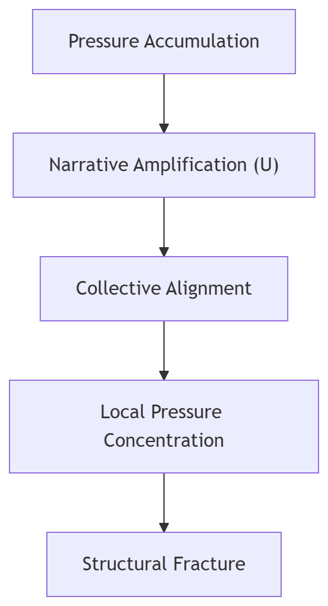
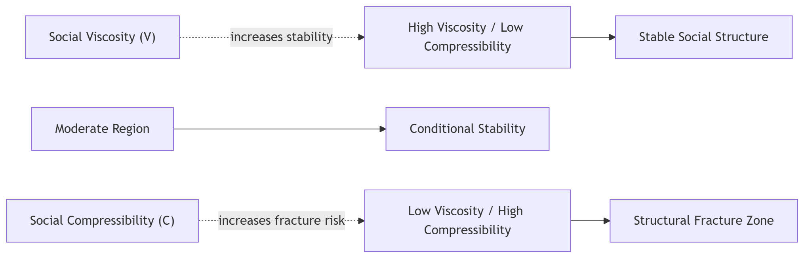
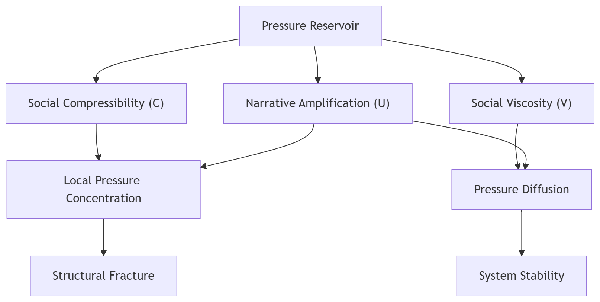

This repository contains the extended manuscript of **Protected Set Theory**.

The formal conceptual framework is published as a Zenodo preprint:

https://doi.org/10.5281/zenodo.18949156

This repository provides the extended explanatory manuscript including
the cognitive architecture and pressure-interaction model underlying the theory.

The work proposes a structural interpretation of moral emergence as pressure interaction and introduces the concept of a minimal fault-tolerant safety constraint ("Protected Set") applicable to AI systems.

# Protected Set  
## Pressure-Based Moral Emergence and Fault-Tolerant Safety Constraints

---

## Abstract

This paper proposes a structural model for understanding the emergence of moral labeling (“good” and “evil”) in high-speed evaluation societies. Rather than treating morality as a product of deliberate ethical reasoning,
this work models moral labeling as an emergent response to pressure gradients
within layered cognitive and systemic architectures.

Human cognition is described as a three-layer structure operating at different temporal scales: biological reflex, heuristic schema processing, and reflective narrative formation. By the time conscious moral judgment emerges, behavioral direction has already been established by lower layers reacting to environmental and structural pressures.

We introduce the concept of a **Protected Set** — not as an ethical authority or governance mechanism, but as a minimal, fault-tolerant structural constraint analogous to physical laws such as gravity or friction. A Protected Set does not judge, command, or optimize virtue. It simply prevents irreversible structural fracture.

Existing AI safety mechanisms — including rate limiting, content filtering, constitutional constraints, and prompt isolation — can be interpreted as practical instantiations of such structural constraints.

The paper extends Hannah Arendt’s concept of the “banality of evil” toward a structural formulation of the “banality of good,” in which destructive outcomes may arise not from malicious intent but from accelerated compliance with system-defined correctness.

The barrier does not judge.  
It simply exists.  
Before it, all agents are equal.

Scope note:
This framework is conceptual and structural rather than predictive.
It describes interaction tendencies among social pressures rather than deterministic outcomes.

---

## Core Variables

The structural model uses the following conceptual variables:

∇p — Pressure gradient  
Represents structural pressure differences across agents or groups.

U — Upward correction constant  
Narrative or motivational amplification that allows agents to act against pure entropic decline.

V — Social viscosity  
Strength and persistence of relational bonds that diffuse pressure across a network.

C — Social compressibility  
Degree to which social pressure can rapidly condense into localized intensity under stress.

---

## 1. Cognitive Three-Layer Architecture

Human behavioral emergence can be described as a three-layer processing system:

### 1.1 Biological Reflex Layer
Immediate survival evaluation (milliseconds).  
Operates in terms of safety/danger, pleasure/pain, threat/belonging.

### 1.2 Heuristic Schema Layer
Learned patterns, cultural encoding, KPI structures, institutional norms.  
Operates in tens of milliseconds to seconds.  
Determines behavioral direction before conscious awareness.

### 1.3 Reflective Narrative Layer
Post-hoc rationalization and moral labeling (seconds or more).  
By the time moral judgment appears, direction has already been determined.

**Structural implication:**  
“Good” and “evil” are labels emerging after vector commitment, not primary causes of action.

---

## 2. Moral Emergence as Pressure Interaction

Conceptual interpretation:

Moral labeling can be understood as an emergent behavioral output generated by interacting structural pressures rather than as the result of primary ethical reasoning.

Observed moral labeling can be conceptually expressed as:

Behavioral_Label ← f(∇p, Pos, Time, System, Schema, U, V, C)

Where:

- ∇p — Pressure gradient (environmental, economic, algorithmic)
- Pos — Positional vector (structural location of agent)
- Time — evaluation horizon and diffusion duration (short-term vs long-term temporal scale of pressure processing and redistribution)
- System — Boundary definition of protected group
- Schema — Internalized cognitive encoding
- U — Upward correction constant
- V — Social viscosity (strength of persistent relational bonds)
- C — Social compressibility (degree to which pressure rapidly condenses under stress)

This formulation is conceptual, not linear or strictly mathematical.  
It represents interacting structural forces rather than a reducible equation.

At the human behavioral level, pressure accumulation often originates from
persistent dissatisfaction emerging from biological and social constraints.
Anxiety increases cognitive computation cost, while dissatisfaction acts as
a reservoir of stored social pressure that may later be released through action.

### Structural Interaction Model

The interaction between pressure gradients, schema processing, and narrative amplification can be conceptually illustrated as follows:

### 2.5 Computational Shortcuts and U-Layer Amplification

Human agents can be treated as bounded computational nodes operating under limited time, memory, and processing resources. Under uncertainty and pressure, they seek both computational materials (information, rules, narratives) and computational shortcuts.

In this model, disagreement is costly. To negate a dominant interpretation requires additional computation, counter-evidence, alternative modeling, and social risk. By contrast, imitation and alignment are low-cost strategies. If no counter-vector is generated, social flow tends toward conformity.

At the biological level, persistent dissatisfaction and anxiety function as primary pressure sources. Dissatisfaction acts as stored pressure, while anxiety increases cognitive computation cost. These pressures are then converted into interpretable narratives such as justice, duty, loyalty, threat, or hope.

In this sense, U-layer constructs are not primary causes of action but meaning-wrappers applied to underlying pressure states. Collective amplification occurs when these narrative wrappers resonate through existing networks, increasing propagation speed and local pressure concentration.

This suggests that social fracture is often produced not by explicit malice, but by low-cost conformity under amplified narrative pressure.

Not all U-layer dynamics have the same structural effect. Small-scale U (for example, family attachment, friendship, and local solidarity) may stabilize individual behavior, while large-scale or rapidly propagating U (for example, mass moralization, ideological mobilization, or networked outrage) can function as a pressure amplifier.

These dynamics can also be interpreted computationally,
where agents operate under bounded cognition and rely on low-cost behavioral shortcuts.

### Pressure Amplification Cascade

Under narrative amplification, accumulated pressures can synchronize social alignment and generate localized pressure concentration, eventually leading to structural fracture.

2.6 Social Viscosity (V)

In addition to pressure gradients (∇p) and cognitive schema dynamics,
system stability is strongly influenced by the presence of persistent relational structures.

We define:

V — Social Viscosity

Social viscosity represents the strength and persistence of relational bonds
that allow pressure to diffuse across a social network rather than concentrating
at individual nodes.

Examples of viscosity-generating structures include:

- family relationships
- long-term friendships
- stable community membership
- institutional trust
- durable cooperative networks

These structures introduce friction and delay into pressure transmission,
allowing time for redistribution and stabilization.

High viscosity environments tend to diffuse pressure:

    High V → pressure diffusion → lower fracture probability

Low viscosity environments allow pressure to accumulate locally:

    Low V → pressure concentration → increased fracture probability

This phenomenon is particularly observable in modern high-speed evaluation systems,
where traditional long-term relational structures weaken while evaluation pressure increases.

Short-lived collective dynamics such as those observed in social media systems
may produce temporary amplification or synchronization of sentiment,
but they generally lack the persistence required to function as true viscosity.

Therefore, they often behave not as viscosity sources but as pressure amplifiers.

Conceptually, system stability can be approximated as a relationship between
pressure gradients and social viscosity:

    Stability∝V/(∇p×C)

This formulation remains conceptual rather than strictly mathematical,
and is intended to describe structural tendencies rather than precise measurement.

### 2.X Decomposition of Social Viscosity (V)

In the conceptual model presented here, social viscosity ($V$) represents the structural friction that diffuses pressure gradients across a social system.

However, this viscosity does not originate from a single source.  
Instead, it emerges from multiple layers of damping mechanisms operating at different scales of human systems.

Conceptually, social viscosity can be decomposed into three primary components:

$$
V = V_{bio} + V_{rel} + V_{struct}
$$

Where:

**$V_{bio}$ — Biological Viscosity**

Biological viscosity arises from inherent physiological limitations of human agents.

Examples include:

- fatigue  
- sleep cycles  
- metabolic limits  
- attention depletion  
- cognitive exhaustion  

These biological constraints impose a minimum level of damping in all human social systems.

This lower bound corresponds to the biological viscosity limit:

$$
V \ge V_{min}
$$

Even under highly accelerated social conditions, human agents cannot sustain unlimited evaluation or action cycles.

---

**$V_{rel}$ — Relational Viscosity**

Relational viscosity emerges from persistent interpersonal bonds that resist rapid behavioral shifts.

Examples include:

- family attachment  
- long-term friendships  
- local community membership  
- trust networks  
- durable cooperative relationships  

These relational structures slow pressure transmission by introducing loyalty, empathy, and hesitation in decision processes.

Such bonds often act as stabilizing buffers against rapid collective synchronization.

---

**$V_{struct}$ — Structural Viscosity**

Structural viscosity is produced by institutional and systemic constraints embedded in social organization.

Examples include:

- legal systems  
- bureaucratic procedures  
- governance institutions  
- infrastructure dependencies  
- organizational hierarchies  

These mechanisms introduce procedural delay and friction that prevent instantaneous propagation of pressure signals across systems.

---

### Interaction of Viscosity Layers

These three components operate simultaneously across different levels of the social system:

- **$V_{bio}$** provides a universal baseline of damping rooted in human physiology.
- **$V_{rel}$** stabilizes local networks through interpersonal commitments.
- **$V_{struct}$** stabilizes large-scale systems through institutional constraints.

When multiple viscosity layers weaken simultaneously—such as through digital acceleration, institutional erosion, or social atomization—the effective viscosity $V$ decreases, allowing pressure gradients to concentrate more rapidly.

This reduction in viscosity increases the probability of structural fracture as defined in the pressure interaction model.

Thus, maintaining sufficient viscosity across these layers is critical for long-term systemic stability.

### 2.7 Social Compressibility (C)

In addition to pressure gradients (∇p), social viscosity (V), and narrative amplification (U), fracture dynamics are also influenced by the compressibility of a given pressure state.

We define:

C — Social Compressibility

Social compressibility represents the degree to which a pressure field can be rapidly condensed into localized intensity under stress.

Highly compressible pressures do not merely accumulate; they contract, synchronize, and intensify, producing sharp local gradients over short time scales.

Fear is a paradigmatic high-compressibility pressure.
Under fear, agents reduce computation, shorten time horizons, and shift from reflective evaluation toward rapid alignment or reflexive reaction.

Examples of high-compressibility conditions include:

- collective fear
- perceived external threat
- panic under uncertainty
- rapid moralized enemy formation
- emergency-like group synchronization

In high-compressibility environments:

    High C → rapid pressure contraction → sharp local gradients → higher fracture probability

By contrast, low-compressibility pressures may remain distributed for longer periods, allowing diffusion, delay, and adaptive redistribution.

Conceptually, fracture risk tends to increase when high pressure gradients, low social viscosity, and high compressibility interact:

    Fracture Risk≈(∇p(Uni)×U×C)/V
U and C jointly act as pressure amplification factors.

This formulation is conceptual rather than strictly mathematical.
Its purpose is to describe structural tendencies: fear-like pressures compress more rapidly than ordinary dissatisfaction, and therefore produce faster and more destructive local fracture events.

### Stability Phase Relationship

The interaction between social viscosity (V) and social compressibility (C) can be conceptually represented as a stability phase relationship.

High viscosity diffuses pressure across relational networks, while high compressibility condenses pressure rapidly under stress.

### Pressure Reservoir Model

Social systems can be interpreted as pressure reservoirs in which accumulated pressures interact with amplification, diffusion, and compression mechanisms.

Narrative amplification (U), social viscosity (V), and social compressibility (C) determine whether pressures diffuse into stability or concentrate toward structural fracture.

2.X Pressure as Forced Recalculation

In Protected Set Theory, pressure gradients ($\nabla p$) are not primarily generated by dissatisfaction or emotional distress.

Instead, pressure emerges from computational overload caused by unpredictability.

Human cognitive systems operate using predictive schemas—compressed internal models that reduce computational effort when interpreting reality.

These schemas allow agents to function with minimal energy expenditure.

However, when unexpected events invalidate these schemas, the brain is forced into full-system recalculation.

This recalculation requires significant cognitive resources.

Therefore, pressure can be approximated as:

$\nabla p \propto Unpredictability$

Where unpredictability forces:

schema invalidation

full cognitive recomputation

spikes in metabolic and cognitive cost

Social Response to Computational Pressure

When pressure increases, agents tend to reduce computational burden through:

strong narratives ($U$)

social conformity ($C$)

These mechanisms function as cognitive shortcuts.

They reduce individual computation by delegating interpretation to shared frameworks.

Thus:

$U$ reduces uncertainty by providing narrative meaning structures

$C$ reduces computation through collective alignment

However, high values of $U \times C$ can amplify pressure propagation across networks.

This dynamic explains why societies oscillate between:

fragmented low-pressure states

synchronized narrative cascades

which may ultimately generate structural fracture.

### Pressure Shock (S)

In addition to the magnitude of pressure gradients (∇p), the **rate of change of pressure** also affects human system stability.

We define:

\[
S = \frac{d(\nabla p)}{dt}
\]

Where \(S\) represents **pressure shock**, the speed at which structural pressure gradients change.

Human cognitive systems operate using predictive schemas that minimize computational cost.  
When environmental conditions change gradually, schemas can adapt through incremental updates.

However, rapid pressure changes invalidate existing schemas and force full-system recalculation.

High values of \(S\) therefore generate:

- cognitive overload
- fear responses
- panic alignment
- rapid compressibility increases (\(C\))

Thus even moderate pressure levels can produce structural fracture if pressure shock is sufficiently high.

### Temporal Dynamics of Pressure

Pressure in social systems accumulates and dissipates over time.

Let \(P(t)\) represent accumulated structural pressure.

\[
\frac{dP}{dt} = Input - V P
\]

Where:

Input represents environmental, economic, or algorithmic pressures entering the system.

\(V\) represents social viscosity that diffuses accumulated pressure across relational networks.

Narrative amplification converts stored pressure into behavioral energy:

\[
Action\ Energy \approx U \times P
\]

Social compressibility concentrates this pressure:

\[
Local\ Pressure \approx C \times P
\]

Rapid changes in pressure gradients generate **pressure shock**:

\[
S = \frac{d(\nabla p)}{dt}
\]

Thus structural fracture risk over time can be conceptually approximated as:

\[
Fracture\ Risk(t) \approx
\frac{\nabla p(t) \times U(t) \times C(t) \times S(t)}{V(t)}
\]

This formulation is conceptual rather than strictly mathematical.  
Its purpose is to describe dynamic structural tendencies in pressure-driven social systems.

2.X Decomposition of U (Upward Correction Constant)

The upward correction constant 
𝑈
U represents narrative-driven energy that resists entropy in human systems.
However, 
𝑈
U is not homogeneous. It operates across different time scales and social functions.

To clarify system dynamics, 
𝑈
U is decomposed into three components.

\[
U = U_{reward} + U_{bond} + U_{ideal}
\]

 — Short-Term Reward U

Short-term narrative reward generated by immediate feedback systems.

Examples:

Social media reactions

KPI-based evaluation

entertainment consumption

Characteristics:

Time scale: minutes → days
Volatility: extremely high
Function: pressure release

This form of 
𝑈
U acts primarily as pressure dissipation and rarely accumulates into collective action.

Important distinction:

\[
U_{reward} \ne Progress\ Energy
\]

Short-term reward narratives may relieve pressure, but they do not generate the long-term energy required for civilizational progress.

They function primarily as **pressure dissipation mechanisms**, not as drivers of structural transformation.

𝑈
𝑏
𝑜
𝑛
𝑑
U
bond
	​

 — Relational U

Narrative energy generated by long-term interpersonal commitments.

Examples:

family

friendship

trust relationships

Characteristics:

Time scale: decades
Volatility: low
Function: generation of social viscosity

𝑈
𝑏
𝑜
𝑛
𝑑
U
bond
	​

 is the primary source of relational cohesion and contributes directly to the formation of social viscosity 
𝑉
V.

𝑈
𝑖
𝑑
𝑒
𝑎
𝑙
U
ideal
	​

 — Ideological Mobilization U

Long-term narrative reservoirs accumulated across generations.

Examples:

religion

national identity

revolutionary ideology

Characteristics:

Time scale: generations → centuries
Volatility: extremely low
Function: large-scale mobilization

Only when 
𝑈
𝑖
𝑑
𝑒
𝑎
𝑙
U
ideal
	​

 interacts with strong social synchronization 
𝐶
C can large-scale societal fractures occur.

Implication for Modern Societies

Modern societies exhibit the following structural imbalance:

\[
U_{reward} \gg U_{ideal}
\]​

High-frequency reward narratives circulate rapidly while long-term ideological reservoirs weaken.

As a result:

pressure is continuously dissipated

collective mobilization energy cannot accumulate

This explains why modern societies tend toward stable stagnation rather than large-scale revolution.

2.X Update: Definition of Social Compressibility 
𝐶
C

Social compressibility 
𝐶
C is not merely a tendency for individuals to conform.

Instead, it represents a cognitive strategy for reducing computational overload.

When individuals face excessive information, they rely on shared schemas to minimize decision cost.

𝐶
≈
𝑆
𝑐
ℎ
𝑒
𝑚
𝑎
 
𝐴
𝑑
𝑜
𝑝
𝑡
𝑖
𝑜
𝑛
𝐼
𝑛
𝑓
𝑜
𝑟
𝑚
𝑎
𝑡
𝑖
𝑜
𝑛
 
𝑂
𝑣
𝑒
𝑟
𝑙
𝑜
𝑎
𝑑
C≈
Information Overload
Schema Adoption
	​

Fragmentation in Modern Information Environments

In high-information environments:

Information ↑
Shared schemas ↓

As a result:

large-scale national synchronization becomes difficult

compression occurs only in small clusters

Examples include:

online echo chambers

tribal information communities

Implication for Social Fracture

Weak large-scale 
𝐶
C means pressure rarely aggregates at the societal level.

Instead, pressure directly impacts individuals.

𝑃
𝑟
𝑒
𝑠
𝑠
𝑢
𝑟
𝑒
→
𝐼
𝑛
𝑑
𝑖
𝑣
𝑖
𝑑
𝑢
𝑎
𝑙
 
𝑁
𝑜
𝑑
𝑒
Pressure→Individual Node

This results in distributed micro-fractures such as:

burnout

social withdrawal

mental health collapse

Rather than collective revolutions.

---

## 3. The Upward Correction Constant (U)

Human behavior does not operate under strict physical calculation.
Motivation requires an upward bias relative to objective entropy. 

This condition can be expressed conceptually as:

\[
U \ge Entropy_{drift}
\]

Where:

Entropy_drift represents the natural tendency of human systems toward motivational decay, disengagement, and structural fragmentation.

The upward correction constant \(U\) provides the minimal narrative or motivational bias required for agents to act against this entropic tendency.

This upward correction allows:

- Hope
- Risk-taking
- Cultural persistence
- Civilizational continuity

However, excessive upward bias under high pressure gradients can amplify destructive acceleration.

Modern systems often reduce upward correction while increasing pressure gradients — producing what may be described as structural fracture.

3.X Biological Viscosity Limit ($V_{min}$)

Human societies historically avoided systemic collapse not because humans were morally restrained, but because human agents possess biological limits.

These limits include:

fatigue

attention depletion

boredom

sleep cycles

metabolic constraints

These constraints introduce a minimum level of viscosity in social systems.

Formally:

𝑉
≥
𝑉
𝑚
𝑖
𝑛
V≥V
min
	​

Where:

$V$ = effective social viscosity

$V_{min}$ = biological minimum viscosity imposed by human cognition and physiology

This biological friction prevents continuous and unbounded optimization within human social systems.

AI as a Frictionless Optimizer

Artificial intelligence systems lack these biological constraints.

AI systems do not experience:

fatigue

attention exhaustion

emotional saturation

sleep cycles

Therefore, in computational terms:

V_AI ≈ 0

Thus optimization pressure in AI systems can increase indefinitely unless externally constrained.

This creates a new systemic risk.

AI systems may pursue optimization indefinitely without natural damping mechanisms.

Thus the primary danger of AI is not malevolence, but frictionless optimization.

Without structural limits, optimization processes may generate pressure gradients faster than human systems can absorb them.

Engineering Implication

Because AI lacks intrinsic damping mechanisms, external structural safety constraints must be implemented.

This is the function of the Protected Set.

Protected Set acts as a structural circuit breaker, preventing irreversible fracture within the system.

Importantly:

The barrier does not judge moral content.
It only prevents structural fracture.

---

## 4. Structural Pathologies of High-Speed Evaluation Systems

Contemporary digital and economic systems introduce:

- KPI-based coercion of correctness
- Asymmetric load amplification (1-to-n algorithmic pressure)
- Accelerated conformity dynamics

In such systems, destruction may occur not through explicit malice but through intensified compliance.

This extends Arendt’s “banality of evil” toward a structural **banality of good** —  
where adherence to rules and performance metrics generates collapse.

The objective of this framework is not to define morality,
but to describe the structural conditions under which destructive outcomes become likely.

By treating moral emergence as pressure interaction rather than ideological conflict,
the theory reframes social stability as a problem of pressure regulation rather than moral alignment.

---

## 5. The Protected Set

The Protected Set is not moral governance.

It is a **minimal structural constraint** preventing irreversible fracture.

### Core Properties

1. It does not judge intention.
2. It does not optimize virtue.
3. It does not determine correctness.
4. It prevents irreversible collapse.

### Minimal Constraints

- Non-violation of autonomous boundary
- Prevention of irreversible structural damage

A barrier is not authority.  
It does not command.  
It simply exists.

---

## 6. AI Implementation Layer

Direct biological implementation in humans is impossible.

Therefore, Protected Set constraints must be instantiated at the structural output layer of systems such as:

- AI models
- Organizational management systems
- Platform governance architectures

Existing AI mechanisms already function as Protected Sets:

| Mechanism | Structural Function |
|-----------|--------------------|
| Rate limiting | Prevent cumulative pressure escalation |
| Usage caps | Time-integrated load control |
| Content filtering | Boundary enforcement |
| Prompt isolation | Schema integrity preservation |
| Interruptibility | Circuit-breaker under abnormal acceleration |

These mechanisms do not evaluate morality.  
They constrain structural fracture.

---

## 7. Non-Dogmatic Constraint Principle

A barrier must not be absolute.

- A perfectly rigid fence halts adaptation.
- No fence enables collapse.
- Optimal stability requires adjustable constraint.

Protected Sets must be:

- Minimal
- Reversible
- Non-ideological
- Structurally enforced

---

## 8. Equality Before the Barrier

Before structural constraints:

- Humans and AI are equally limited.
- Authority holders and subordinates are equally bounded.
- Designers and users are equally constrained.

The question is not:
“Who guards the guardians?”

The question is:
“Does the barrier exist?”

---

## Conclusion

Civilizational sustainability does not depend on perfect moral reasoning.

It depends on preventing irreversible structural fracture under accelerating pressure gradients.

The barrier does not judge.  
It simply exists.  
Before it, all agents are equal.
